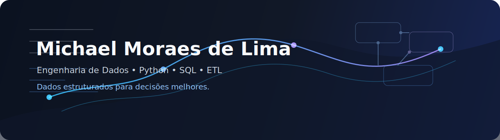

  

<h1 align="center">Michael Moraes de Lima</h1>

  Profissional que conecta negócio, dados e tecnologia para construir soluções úteis, automatizar processos e melhorar a tomada de decisão.

  
  
  
  

## Sobre

Sou um profissional que conecta negócio, dados e tecnologia para resolver problemas reais. Minha trajetória começou em operações, gestão e tomada de decisão, experiência que me ensinou a compreender processos, identificar gargalos e avaliar o impacto das decisões no resultado das empresas.

Com o tempo, passei a transformar desafios operacionais em soluções técnicas, desenvolvendo sistemas, automações, APIs, bancos de dados, pipelines de dados e dashboards. Hoje utilizo programação e engenharia de dados para estruturar informações, reduzir atividades manuais e transformar dados em recursos confiáveis para o negócio.

Tenho interesse especial em Engenharia de Dados, Analytics Engineering, Arquitetura de Dados, Desenvolvimento Python, Inteligência Artificial, negócios e finanças.

## O Que Faço

- Transformo processos de negócio em fluxos digitais mais claros, rastreáveis e automatizados.
- Desenvolvimento soluções com Python, SQL, APIs, bancos de dados e ferramentas de automação.
- Estruturo dados para análise, indicadores, dashboards e tomada de decisão.
- Conecto visão operacional, lógica de negócio e construção técnica de ponta a ponta.

## Experiência e Impacto

### Tekar Auto Center

**Fevereiro de 2025 até o momento**  
Atuação em gestão do negócio, análise de dados, desenvolvimento Python, automação, construção de sistemas, estruturação de processos e liderança operacional.

Principais entregas:

- ERP próprio assistido por IA para centralizar clientes, veículos, produtos, estoque e ordens de serviço.
- Backend com APIs REST, modelagem de banco de dados PostgreSQL e integração com serviços externos.
- Pipeline para leitura automatizada de recibos em PDF, transformação dos dados e integração com Power BI.
- Dashboard executivo com análises de faturamento, churn, cohort, Pareto, Curva ABC, clientes e serviços.
- Automações com Python, n8n e Make.

Resultados observados:

- Cerca de 50 clientes atendidos por mês e 70 ordens de serviço por mês.
- Mais de 500 PDFs processados.
- Processo manual de 2 a 3 minutos reduzido para execução praticamente instantânea.
- 3 automações implantadas e 1 dashboard executivo criado.

### Temarc

**Analista de Negócios Sênior | Janeiro de 2020 a fevereiro de 2025**  
Atuação em compras, vendas, orçamentos, logística, produção, demanda, fornecedores, clientes, pagamentos, fluxo de caixa, relatórios executivos, almoxarifado, negociação e liderança de equipe.

Resultados observados:

- Liderança direta de 5 pessoas em uma empresa com aproximadamente 20 funcionários.
- Relacionamento com mais de 50 fornecedores e média de 30 orçamentos mensais.
- 5 planilhas automatizadas.
- Redução aproximada de 50% no tempo de elaboração de relatórios.
- Economia média de aproximadamente 40% em orçamentos por meio de pesquisa de preços e negociação.
- Melhoria aproximada de 15% no controle de estoque após migração do papel para Excel.
- Dashboards financeiros e comparativos de fornecedores.

## Stack Tecnológica

### Experiência prática

  

  
  
  
  
  
  
  
  
  
  
  
  

### Organização por área

| Área | Tecnologias e conceitos |
| --- | --- |
| Linguagens e desenvolvimento | Python, SQL, FastAPI, Pydantic, SQLAlchemy, APIs REST, JSON, Regex |
| Dados e processamento | Pandas, NumPy, ETL, ELT, PyArrow, PDFPlumber |
| Bancos de dados | PostgreSQL, Supabase |
| Analytics e visualização | Power BI, Excel, Streamlit, Plotly, Matplotlib, Seaborn |
| Engenharia de software e DevOps | Git, GitHub, Git Flow, branches de feature, Pull Requests, revisão de código |
| Automação e IA | n8n, Make, inteligência artificial generativa, LLMs, desenvolvimento assistido por IA |

## Atualmente Estudando

Tecnologias e conceitos em aprofundamento, prática de laboratório ou projetos em desenvolvimento:

  

  
  
  
  
  
  
  
  
  
  

## Projetos em Destaque

| Projeto | Descrição | Tecnologias | Status |
| --- | --- | --- | --- |
| [ERP AutoCenter](https://github.com/devmichaellima/erp_autocenter) | Sistema de gestão de oficina automotiva criado para centralizar clientes, veículos, produtos, estoque e ordens de serviço. | Python, FastAPI, PostgreSQL, SQLAlchemy, APIs REST, modelagem de banco de dados | Repositório público |
| [PDF Intelligence Platform](https://github.com/devmichaellima/pdf_etl_platform) | Pipeline ETL para leitura automatizada de recibos em PDF, extração de dados, transformação, armazenamento em PostgreSQL e análise no Power BI. | Python, PDFPlumber, Regex, Pandas, PostgreSQL, SQLAlchemy, Streamlit, Power BI, Plotly | Repositório público |
| Financial Analytics Lakehouse | Plataforma de dados financeiros para integrar informações da CVM, Yahoo Finance e Banco Central em análises sobre instituições financeiras e mercado de capitais. | Python, SQL, PostgreSQL, Spark, PySpark, Airflow, dbt, arquitetura Medalhão, Power BI, Docker | Em desenvolvimento |
| SocialFlow AI | Plataforma para centralizar ideias de conteúdo, gerar publicações com IA, adaptar textos para redes sociais e organizar calendário editorial. | Python, FastAPI, PostgreSQL, SQLAlchemy, Pydantic, Streamlit, Docker, LLMs | Planejamento e desenvolvimento |
| Enriquecimento de CEP | Pipeline em Python que lê uma base de CEPs, consulta API pública e devolve endereço completo para enriquecimento dos dados. | Python, Pandas, API REST, JSON, enriquecimento de dados | Projeto sem link público informado |

## Temas de Interesse

Engenharia de Dados, Arquitetura de Dados, Analytics Engineering, Python, SQL, automação, inteligência artificial, negócios, finanças, produtividade, construção de produtos e desenvolvimento profissional.

## Formação e Certificações

**Bacharelado em Engenharia de Software**  
UNINTER | Início em fevereiro de 2026 | Em andamento

**Certificações em andamento**

- Google Data Analytics Professional Certificate
- Microsoft PL-300

**Formação complementar e estudos**

- Microsoft Learn, Alura, DIO e Hashtag Treinamentos.
- Apache Spark, PySpark, Apache Airflow, dbt, Databricks, Microsoft Fabric, arquitetura Lakehouse, arquitetura Medalhão, Data Warehouse, modelagem dimensional, Star Schema, AWS, Azure, Google Cloud Platform, Docker e Engenharia de Dados.

## Estatísticas do GitHub

<!--
Serviços externos de estatísticas podem ficar temporariamente indisponíveis ou lentos.
Se isso prejudicar o visual do perfil, mantenha esta seção comentada ou remova os cards abaixo.
-->

  
  

## Contato

Estou em São Paulo, SP, Brasil, e aberto a conversas sobre dados, automação, engenharia de software, inteligência artificial aplicada a negócios e projetos orientados por informação.

- LinkedIn: [michael-lima-683aa3242](https://www.linkedin.com/in/michael-lima-683aa3242)
- WhatsApp: [+55 11 95987-8735](https://wa.me/5511959878735?text=Ol%C3%A1%20Michael%2C%20encontrei%20seu%20perfil%20no%20GitHub%20e%20gostaria%20de%20conversar.)
- E-mail: [dev.michaellima@gmail.com](mailto:dev.michaellima@gmail.com)
- GitHub: [devmichaellima](https://github.com/devmichaellima)
